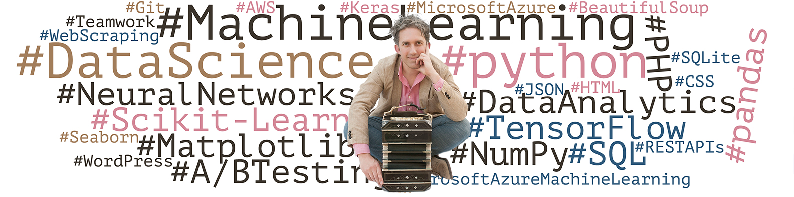
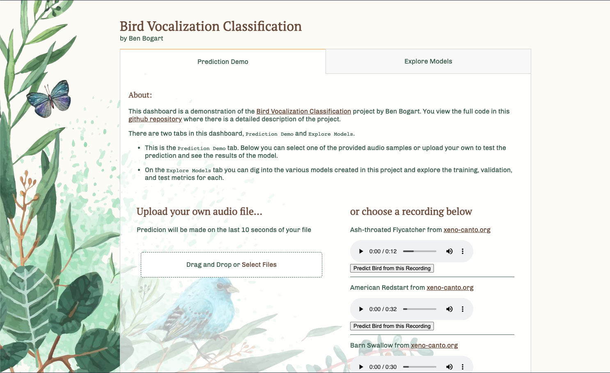
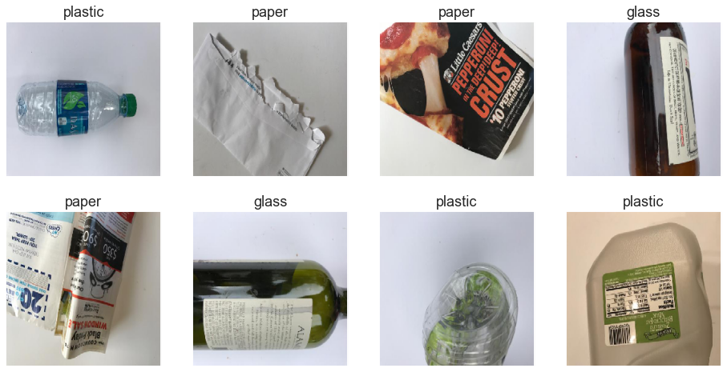

# Ben Bogart

## 👨‍💻 About me

**Data Scientist, Machine Learning Engineer & Towards Data Science Contributor | Research based data visualization and modeling to save the planet.**

Do you love data? **I do**…. shh.

I have spent the last 20 years as a professional musician. I’m starting to think of this “day job” playing music, not as my true identity but, as my Clark-Kent-like alter-ego.

It’s a good cover and I enjoy it. My alter-ego has won performance awards and charted on the Billboard World Music chart. I tour the world playing Argentine Tango and inspiring audiences to take tangible action in the fight against climate change and I serve as President of a nonprofit organization that strives to make the world a better place one tango at a time.

But nearly all of this was made possible by my ability to interact with data, not by the years I spent in Argentina or in school learning to play tango music.

It's only now that I am realizing my true identity is: Data Scientist. (What do you think of “TensorFlow” as my superhero name?) 
While I do not travel the world as a data scientist, I’ve learned that it is far more powerful at affecting change than playing music. I’ve used machine learning with TensorFlow and sklearn to leverage data to do everything from budgeting performances, to classifying bird vocalizations, categorizing waste images for recycling, and determining which advertisements will perform best. I have limitless ideas for what to build next and how it can help the world.

After spending my life building communities of musicians, teachers, volunteers, and students, it's now time for me to join a team that values intentional interaction, productivity, humanity, and science to motivate meaningful change.

I am open to work in Data Science, Machine Learning, Data Engineering, or Analytics in programs that contribute to making the world a better place, in particular teams that directly or indirectly contribute to humanity’s pivot to carbon neutrality. If you think I’d be a good fit for your time I’d love to chat with you. Contact me at [ben@benbogart.com](mailto:ben@benbogart.com).

## 🖋️ Blog

I am a contributing writer for [Towards Data Science](https://towardsdatascience.com/), [Analytics Vidhya](https://medium.com/analytics-vidhya) and [The Startup](https://medium.com/swlh) on Medium.  You can find my latest at [benbogart.medium.com](https://benbogart.medium.com)

Here are a couple highlights

* [Train on Cloud GPUs with Azure Machine Learning SDK for Python](https://towardsdatascience.com/train-on-cloud-gpus-with-azure-machine-learning-sdk-for-python-967c99418df1)
  A getting started guide to running Machine Learning Models on GPU powered compute instances in the Azure Machine Learning Studio cloud
* [Basic Animation with Matplotlib and Plotly](https://towardsdatascience.com/basic-animation-with-matplotlib-and-plotly-5eef4ad6c5aa).
  The shortest path to simple animation with the most popular plotting libraries for python.

# 📈 Featured Data Science Projects

* ### [Bird Vocalization Classification](https://github.com/benbogart/bird_vocalization_classification) [with [heroku dashboard](https://bird-vocalization.herokuapp.com/)] - A TensorFlow based Bird Vocalization Classifier which predicts bird species from recordings.

  

* ### [Waste Classifiction](https://github.com/benbogart/waste-classification) - An image based waste classifier as a test case for image based recycling using TensorFlow

  

## 🛠️ Technologies and Tools

✨✨✨✨✨

## 📇 Contact Info:
* [LinkedIn](https://linkedin.com/in/benbogart)
* ben@benbogart.com
* (812) 276-3346

