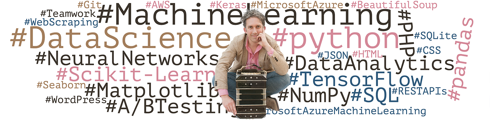

# Ben Bogart

I build data and AI systems in hard domains — climate, carbon markets, agriculture at scale. Currently: building a personal multi-agent AI system for knowledge work, and developing a music-based typing trainer at the intersection of music and machine learning.

Looking for: founding engineer roles at AI startups, and director-level engineering or data leadership at climate-tech companies.

---

## What I'm Building

**AI agent system for knowledge work** — A personal software factory: specialized agents with defined roles — product, research, implementation, review — that coordinate to help me build reliable software quickly. Backed by a structured knowledge repository, so agents draw on project context and accumulated decisions, not just the internet and training data.

**[keybr-music](https://github.com/benbogart/keybr-music)** — A fork of [keybr](https://github.com/aradzie/keybr.com) that I'm developing into a music-based typing trainer. My own concept, developed using my software factory — delegated automation with human-in-the-loop where it matters.

---

## Featured Projects

**[Bird Vocalization Classification](https://github.com/benbogart/bird_vocalization_classification)** — TensorFlow classifier that identifies bird species from audio recordings. Built a live dashboard. The audio classification problem is more interesting than it looks: variable-length signals, overlapping calls, long-tail class distributions.

**[emissions-bulb](https://github.com/benbogart/emissions-bulb)** — Real-time CO₂ emissions data from the Sense Energy Monitor API, visualized as a smart bulb. Climate data at the household level.

**[geospatial-python](https://github.com/benbogart/geospatial-python)** — Geospatial analysis and visualization in Python. Relevant to land-use, forestry, and carbon project work.

**[TickTickToOmniFocus4](https://github.com/benbogart/TickTickToOmniFocus4)** — OmniFocus plugin that imports TickTick CSV exports. Small utility, but I needed it, so I built it.

---

## Writing

I write about applied data science, ML engineering, and building diverse technical teams on [Medium](https://benbogart.medium.com) — published in Towards Data Science, Analytics Vidhya, and The Startup.

Worth reading:
- [Building a Diverse Team](https://medium.benbogart.moretango.org/building-a-diverse-team-10205fe79e44) — on hiring and building inclusive data science teams
- [Deploying a Docker container with ECS and Fargate](https://towardsdatascience.com/deploying-a-docker-container-with-ecs-and-fargate-7b0cbc9cd608)

---

## Tech

Python · SQL · Databricks · AWS · Azure · Docker · Git · LLMs / AI agents · Geospatial (GDAL, GeoPandas)

---

## Contact

[linkedin.com/in/benbogart](https://linkedin.com/in/benbogart) · [ben@benbogart.com](mailto:ben@benbogart.com) · [benbogart.medium.com](https://benbogart.medium.com)

